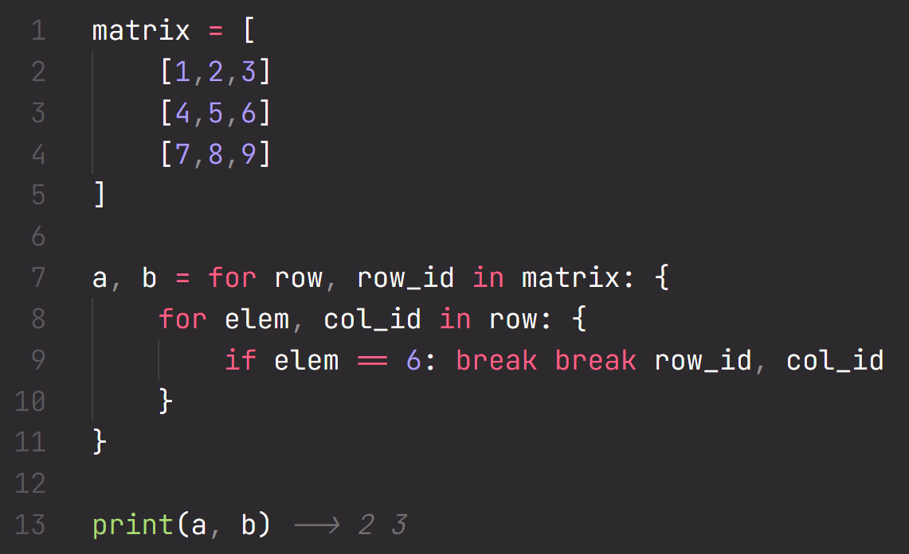

# Oblock language

This vs-code extension provides basic syntax highlighting for the Oblock
language.

## Features
The extension automatically registers for `.ob` files.

## Known Issues
- Parentheses-less function calls do not get highlighted as functions.

## Release Notes
### 0.0.3
- Add missing `nil` constant

### 0.0.2
- Add missing `and` and `or` keywords
- Fix `-` and `\` operators

### 0.0.1
Initial release, for Oblock 0.4 in-dev.
